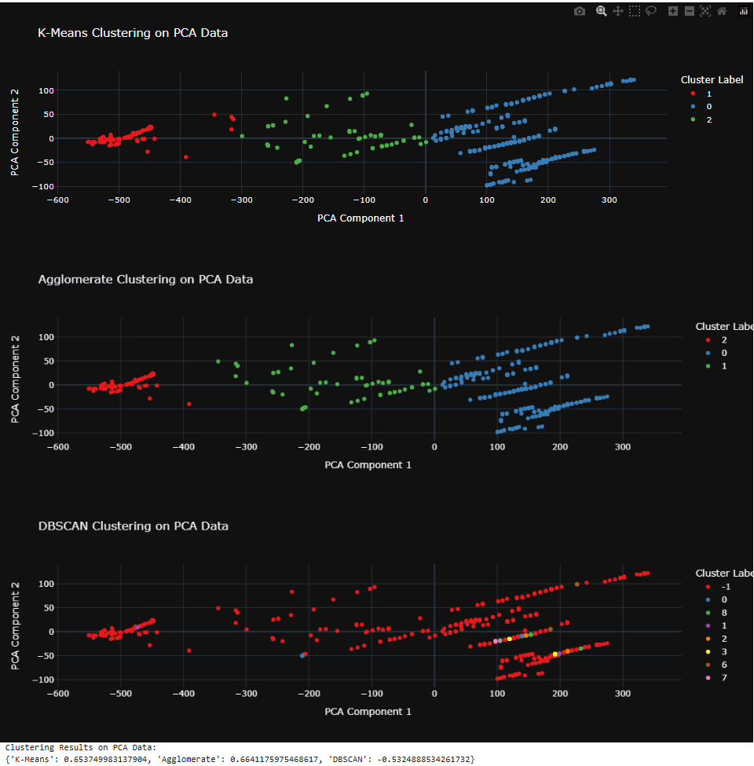

# Forest Fire Clustering and Analysis

This repository contains a comprehensive analysis and clustering project using machine learning techniques to explore the **Forest Fire** dataset. The goal is to preprocess, cluster, and evaluate the dataset using various clustering algorithms and scaling techniques, with additional visualization and dimensionality reduction using PCA.

## Table of Contents
- [Dataset](#dataset)
- [Dependencies](#dependencies)
- [Project Workflow](#project-workflow)
  - [1. Data Exploration and Preprocessing](#1-data-exploration-and-preprocessing)
  - [2. Clustering Analysis](#2-clustering-analysis)
  - [3. Dimensionality Reduction and Visualization](#3-dimensionality-reduction-and-visualization)
- [Results](#results)
## Dataset
The dataset used is the **Forest Fire** dataset. It includes meteorological and forest attributes to predict and cluster fire incidents.  
- **Source**: [Forest Fire Dataset](https://archive.ics.uci.edu/ml/datasets/Forest+Fires)
- **Columns**:
  - Numerical: `X`, `Y`, `FFMC`, `DMC`, `DC`, `ISI`, `temp`, `RH`, `wind`, `rain`
  - Categorical: `month`, `day`
  - Target: `area`

## Dependencies
To replicate this project, ensure the following Python libraries are installed:
- `pandas`
- `numpy`
- `summarytools`
- `plotly`
- `seaborn`
- `matplotlib`
- `sklearn`

## Key Insights and Results

### Key Insights:
- **K-Means** and **Agglomerative Clustering** perform well in PCA space.
- **DBSCAN** struggled with meaningful clustering in PCA-reduced space.
- 
### Clustering Performance Across Different Scalers:

| Clustering Method | StandardScaler | MinMaxScaler | Normalizer |
|--------------------|----------------|--------------|------------|
| **K-Means**       | 0.10           | 0.17         | **0.77**   |
| **Agglomerative** | 0.21           | 0.25         | **0.75**   |
| **DBSCAN**        | -1.00          | **0.27**     | -1.00      |

### Clustering Results with PCA:

| Clustering Method | Silhouette Score |
|--------------------|------------------|
| **K-Means**       | 0.65             |
| **Agglomerative** | 0.66             |
| **DBSCAN**        | -0.53            |

#### Clustering Results with PCA:


These results highlight the impact of scaling and dimensionality reduction on clustering effectiveness.

### Install dependencies using:
```bash
pip install -r requirements.txt

